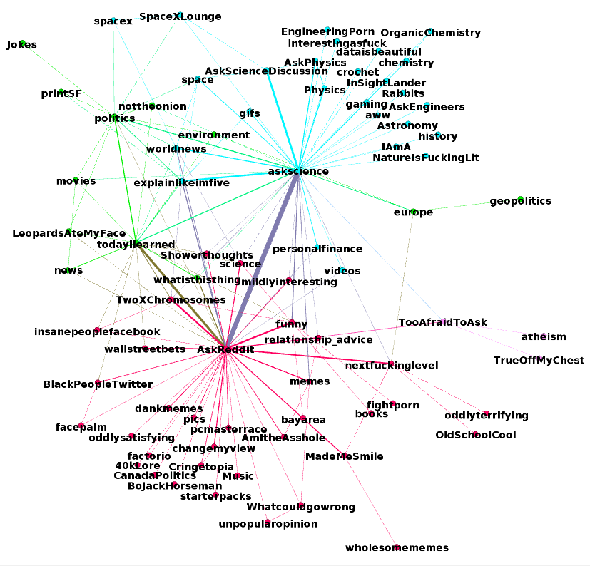

# Large Scale Graph Mining: Visualization, Exploration, and Analysis

This repository contains notebooks and material for the tutorial on large networks analysis, presented at The Web Conf 2021.

You can find more information on the [Tutorial webpage](https://lts2.epfl.ch/reproducible-research/graph-exploration/).

# Program

* Introduction, setting up the environment, general presentation, building a graph from data using Python modules Pandas and Networkx.
* Standard network properties (small world, hubs, centrality, page rank, degree distribution), experiments with Python module Networkx.
* Graph visualization with Gephi. Layouts, visualizing node properties with color, size. Communities, centrality, page rank. Limits of visualization. [Link to tutorials](https://github.com/mizvol/gephi-tutorials/). Walktrhough videos: [Layouts](https://www.youtube.com/watch?v=aRZIeTroUog), [Publishing graphs online](https://www.youtube.com/watch?v=ok4iFOe9niU).
* Principles of graph exploration and sampling. Reducing to a subgraph of interest with graph sampling, experiments on small toy graph models with Python library Little ball of Fur https://github.com/benedekrozemberczki/littleballoffur (Random walks, snowball sampling, Forest Fire, and more advanced Spikyball).
* Conclusion and debriefing of Part I. Challenges, problems, data bottlenecks in large graphs and how to overcome them.
* Some unsupervised and semi-supervised machine learning on graphs: clustering and community detection, label propagation, combining the graph structure with data on nodes (attributed graph). How to apply to large graphs: relation with part I) on graph sampling.
* Exploring online data: online graph sampling via an API where access is limited. Example of Wikipedia and social networks (Reddit pushshift API or Twitter).
* Mini project on real and fresh large graph data, using an API and combining what has been learned during the day.

Each section (except the graph visualization with Gephi) is associated to a Jupyter notebook. These notebooks are described below.

# Notebooks

You can run the notebooks online by clicking on the binder button

You can also run them locally from your computer, check the [Local installation](#local-installation) section

The visualization part uses [Gephi](https://gephi.org), you need to [download the 
latest version](https://gephi.org/users/download/) and install it on your computer. 
It requires a working Java runtime environment.  

## Outline

The Tutorial will explore the world of (large) graphs using the following notebooks:
* `01_graph_from_edge_list.ipynb` is the introduction to building and handling a graph with Python, using `networkx`.
* `02_basic_graph_properties.ipynb` show the different standard methods and tools to get information about the graph structure (graph diameter, connectivity, degree distribution...)
* [Graph visualization using Gephi](https://github.com/mizvol/gephi-tutorials) 
* `03_graph_exploration_and_sampling.ipynb` presents the algorithms for large graph exploration and graph sampling,
* `04_ML_on_graphs.ipynb` proposes to experiment with unsupervised and semi-supervised machine learning on graphs,
* `05_Reddit_Pushshift_API.ipynb` shows in practice how to explore the Reddit social network through the Reddit Pushshift API.
* `06_exploring_wikipedia.ipynb` uses the Wikipedia API with the Spikyball approach to efficiently build a graph of pages and hyperlinks, enriched by additional page information.

## Local installation

If you prefer using the notebooks locally instead of running them on binder, you need to set
up a number of tools.

For a local installation, you will need [git], [Python], and packages from the [Python scientific stack][scipy].
If you don't know how to install those on your platform, we recommend to install [Miniconda] or [Anaconda], a distribution of the [conda] package and environment manager.
Follow the below instructions to install it and create an environment for the course.

1. Download the Python 3.x installer for Windows, macOS, or Linux from <https://conda.io/miniconda.html> and install with default settings.
   Skip this step if you have conda already installed (from [Miniconda] or [Anaconda]).
   * Windows: double-click on `Miniconda3-latest-Windows-x86_64.exe`.
   * macOS: double-click on `Miniconda3-latest-MacOSX-x86_64.pkg` or run `bash Miniconda3-latest-MacOSX-x86_64.sh` in a terminal.
   * Linux: run `bash Miniconda3-latest-Linux-x86_64.sh` in a terminal or use your package manager.
1. Open a terminal.
   Windows: open the Anaconda Prompt from the Start menu.
1. Install git with `conda install git`.
1. Navigate to the folder where you want to store the course material with `cd path/to/folder`.
1. Download this repository with `git clone https://github.com/epfl-lts2/GraphMining-TheWebConf2021`.
1. Enter the repository with `cd GraphMining-TheWebConf2021`.
1. Create an environment with the packages required for the course with `conda env create -f environment_local.yml`.

Every time you want to work, do the following:

1. Open a terminal.
   Windows: open the Anaconda Prompt from the Start menu.
1. Activate the environment with `conda activate graphmining-twc21-local`.
1. Navigate to the folder where you stored the course material with `cd path/to/folder/GraphMining-TheWebConf2021`.
1. Start Jupyter with `jupyter lab`.
   The command should open a new tab in your web browser.
1. Edit and run the notebooks from your browser.
1. Once done, you can run `conda deactivate` to leave the `graphmining-twc21-local` environment.

[git]: https://git-scm.com
[python]: https://www.python.org
[scipy]: https://www.scipy.org
[anaconda]: https://www.anaconda.com/download
[miniconda]: https://conda.io/miniconda.html
[conda]: https://conda.io
[conda-forge]: https://conda-forge.org

